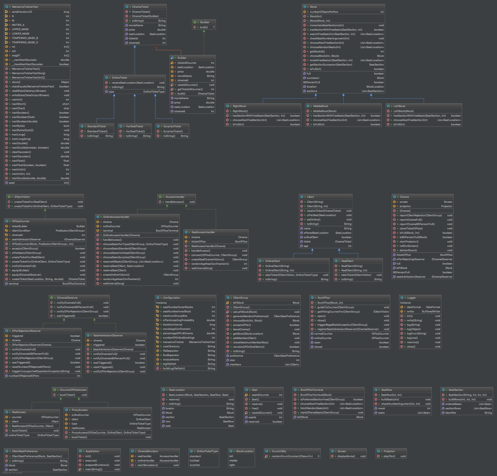

# Design Patterns Individual (DPI) - I40 // Kino

**Used Design Patterns**: Proxy, Chain of Responsibility, Observer

## Klassendiagramm

Insgesamt **43** Klassen mit 2219 Zeilen Quelltext.

## Aufgabenstellung
Ein Kino ist unterteilt in drei Blöcke
1. **links**: 50 Reihen mit je 25 Sitzplätzen
2. **mitte**: 50 Reihen mit je 40 Sitzplätzen und
3. **rechts**: 50 Reihen mit je 25 Sitzplätzen.

Die Reihen sind in Abschnitte beginnend von vorne eingeteilt:
1. A: 1-5,
2. B: 6-15,
3. C: 16-25,
4. D: 26-45 und 
5. E: 46 – 50.

Es existieren zwei Typen von Kunden
1. normal und
2. online.

Kunden vom Typ **normal** kaufen ein Ticket zum Normalpreis von 10 Euro an der Abendkasse.
Die Abendkasse hat zwei Schalter
1. Einzelperson, Gruppe mit 2 Personen und
2. Online, Gruppe mit mindestens 3 Personen.

Grundsätzlich werden Gruppen nicht aufgeteilt, sondern sitzen nebeneinander. Die Einzelperson oder
Gruppe nennt Ihre Präferenz bezüglich Block und Abschnitt. Sofern die Präferenz nicht erfüllt werden
kann, wird ein anderer Abschnitt im präferierten Block ausgewählt und zugeteilt. Ist der Block ausgebucht,
wird ein anderer Block angeboten. Mit einer Wahrscheinlichkeit von 70% stimmt der Kunde dem Angebot zu.
Wird das Angebot abgelehnt, verlässt der Kunde das Kino. Registrierte Kunden vom Typ **online** buchen
über ein Portal (Proxy). Online-Buchungen sind bis zum Öffnen der Abendkasse möglich. Beim Online-Ticket
existieren drei Typen
1. Standard (9 Euro, Kunde wählt Sitzplatz aus)
2. Hot Deal (8 Euro, Kunde wählt Block aus, zufällig freier Sitzplatz im selektierten Block) und
3. Surprise (5 Euro, zufällig freier Sitzplatz).

Die Abendkasse schließt 10 Minuten vor dem Beginn der Vorstellung. Zu Simulationszwecken wird alle 200 ms
zufällig eine Einzelperson, Gruppe mit 2 Personen, Gruppe mit 3 Personen oder Gruppe mit 4 Personen generiert.
Die Simulation endet, wenn
1. alle Plätze belegt sind oder
2. die Plätze zu 95% belegt sind und zum dritten Mal ein Kunde das Angebot abgelehnt hat.

---

**HINWEIS**

Die Klassendiagramme befinden sich im Verzeichnis [`uml/`](uml).

---

## Zielsetzungen
1. Wiederholung und Vertiefung des Wissens zu Design Patterns.
2. Praktische Anwendung der Design Patterns auf komplexe Aufgabenstellungen.
3. Optimale Klausurvorbereitung im Hinblick auf eine vorzugsweise sehr gute Bewertung.

## Wichtige Hinweise
* Pro Student wird eine Aufgabe bearbeitet.
* Die Zuordnung einer Aufgabe zu einem Studierenden erfolgt mit einem Zufallsgenerator.
* Bearbeitung der Aufgaben lokal auf den Rechnern und Nutzung der Templates.
* Studium der Struktur und Funktionsweise der beteiligten Design Patterns.
* Verwendung geeigneter englischer Begriffe für Namen und Bezeichnungen.
* Modellierung eines Klassendiagramms in Enterprise Architect. Bitte
   * nutzen Sie das Theme „DHBW“ (Visual Style -> Visual Appearance -> Diagram).
   * benennen Sie das Klassendiagramm mit task<id>, z.B. task50.
   * benennen Sie die Datei mit <matrikelnummer>_<task_id>.eap, z.B. 3378535_50.eap.
   * exportieren Sie das Klassendiagramm als PDF-Datei mit einer A4-Seite im Querformat.
* Implementierung einer einwandfrei lauffähigen Applikation in Java 8. Bitte
   * erstellen Sie ein Paket mit der Bezeichnung task<id>, z.B. task50.
   * nutzen Sie die camelCase-Notation, um die Lesbarkeit zu vereinfachen.
* Test der Implementierung mit JUnit und Gewährleistung der Funktionsweise.
* Modellierung wird mit 5 Punkten und Implementierung mit 10 Punkten bewertet.
* Erstellung einer vollständigen und verschlüsselten 7-Zip-Datei unter Beachtung
  des Prozedere für die Abgabe von Prüfungsleistungen und der Namenskonvention.
* Zeitansatz: 20 Stunden
* Abgabetermin: Sonntag, 25.02.2018
* Bewertung: 15 Punkte
